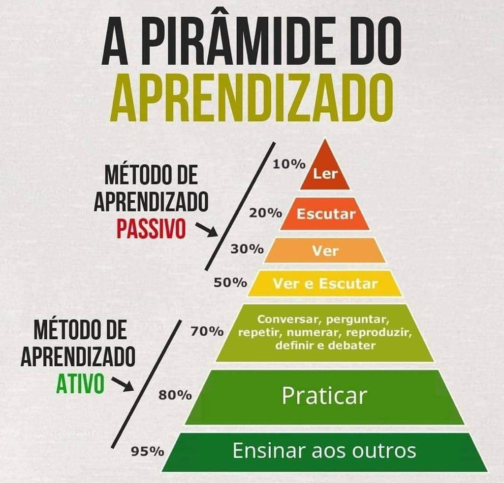

<h1 align="center">
    Proffy - Projeto do Next Level Week #2 da RocketSeat.
</h1>

  

  

  

  
  

  

  <a href="#rocket-tecnologias-e-recursos">Tecnologias e Recursos</a>&nbsp;&nbsp;&nbsp;|&nbsp;&nbsp;&nbsp;
  <a href="#information_source-sobre">Sobre</a>&nbsp;&nbsp;&nbsp;|&nbsp;&nbsp;&nbsp;
  <a href="#memo-licença">Licença</a>

## :rocket: Tecnologias e Recursos

- [React][rct]
- [React Native][rctn]
- [TypeScript][ts]
- [Node.js][njs]
- [Knex.js][kjs]
- [SQLite][sql]
- [ECMAScript][es]
- [Axios][axios]
- [React Icons][ric]
- [VS Code][vc] with [EditorConfig][vceditconfig] and [ESLint][vceslint]

## :information_source: Sobre

Aplicação web e mobile que funciona como um agente intermediário entre professores e alunos que querem e tem disponibilidade para ensinar e aprender respectivamente.

O projeto Next Level Week, é uma experiência única com muito conteúdo prático, desafios, promovida pelo Diego Fernandes da Rocketseat, e tem como base 3 pilares:

1. Foco - Ser objetivo e evitar distrações, resolvendo problemas e gerando valor com escolhas mais conscientes e efetivas.

2. Prática - Acumular experiência e saber o momento certo de aplicar a teoria de forma eficiente. A prática auxilia a tomada de decisões, e torna a pessoa cada vez mais segura.

3. Grupo - Se aproximar de profissionais com objetivos em comum, trocar experiências e compartilhar conhecimento é fundamental.

A ideia desse pilares é semelhante com a [Pirâmide de Aprendizado de William Glasser](https://pt.wikipedia.org/wiki/Pirâmide_de_aprendizagem), que nos dizia através de um estudo que:

> Depois de duas semanas, o cérebro humano lembra 10% do que leu; 20% do que ouviu; 30% do que viu; 50% do que viu e ouviu; 70% do que disse em uma conversa/debate; e 90% do que vivenciou a partir de sua prática.

  

## :memo: Licença

Este projeto está sob a licença do MIT. Veja a [LICENÇA](https://github.com/JVidalN/proffy/blob/master/LICENSE) para mais informações.

---

Feito com ♥ por Jean Vidal :wave: [Entre em contato!](https://www.linkedin.com/in/jvidalnunes/)

[vc]: https://code.visualstudio.com/
[vceditconfig]: https://marketplace.visualstudio.com/items?itemName=EditorConfig.EditorConfig
[vceslint]: https://marketplace.visualstudio.com/items?itemName=dbaeumer.vscode-eslint
[es]: https://www.ecma-international.org
[rct]: https://pt-br.reactjs.org
[rctn]: https://reactnative.dev
[ts]: https://www.typescriptlang.org
[njs]: https://nodejs.org
[kjs]: http://knexjs.org
[sql]: https://www.sqlite.org/index.html
[ric]: https://react-icons.github.io/react-icons/
[axios]: https://github.com/axios/axios
